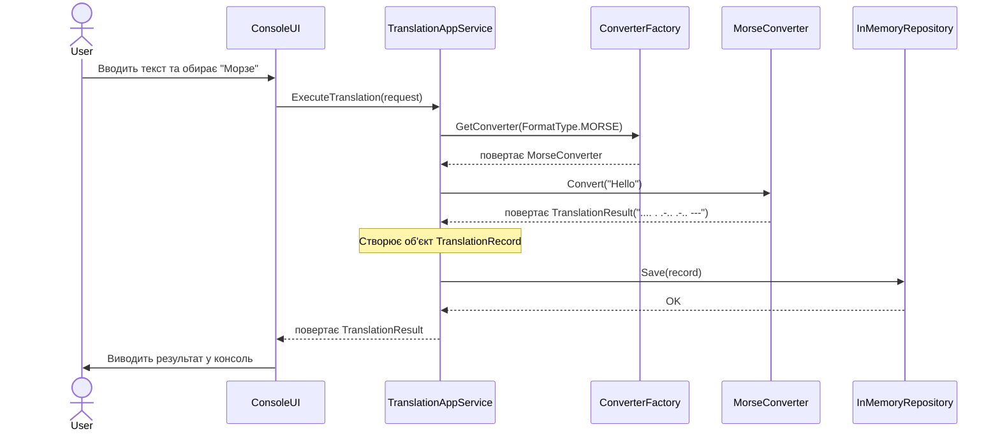

```mermaid
sequenceDiagram
    actor User
    participant UI as ConsoleUI
    participant App as TranslationAppService
    participant Fact as ConverterFactory
    participant Conv as MorseConverter
    participant Repo as InMemoryRepository

    User->>UI: Вводить текст та обирає "Морзе"
    UI->>App: ExecuteTranslation(request)
    
    App->>Fact: GetConverter(FormatType.MORSE)
    Fact-->>App: повертає MorseConverter
    
    App->>Conv: Convert("Hello")
    Conv-->>App: повертає TranslationResult(".... . .-.. .-.. ---")
    
    Note over App: Створює об'єкт TranslationRecord
    
    App->>Repo: Save(record)
    Repo-->>App: OK
    
    App-->>UI: повертає TranslationResult
    UI->>User: Виводить результат у консоль
```